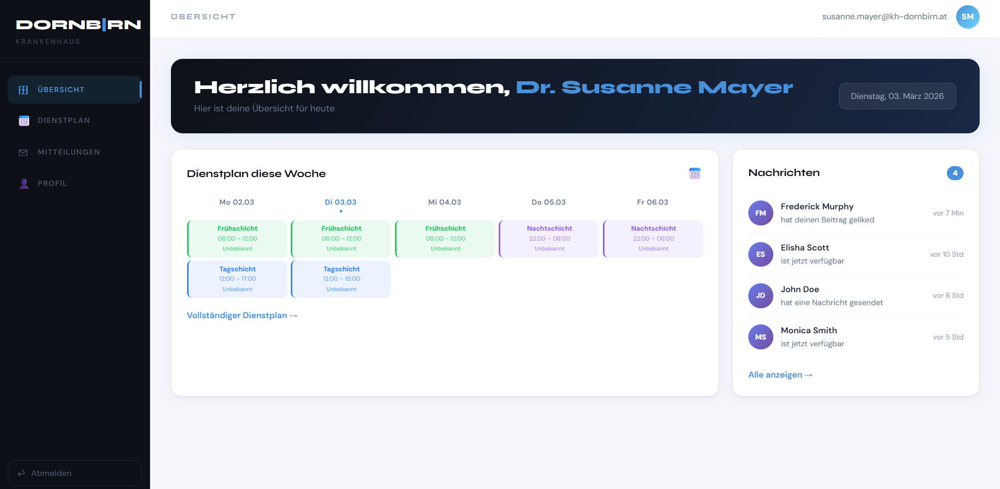

# 🏥 Krankenhaus Dienstplan System

## 📌 Projektbeschreibung

Dieses Projekt ist ein Dienstplan-System für die Krankenhausambulanz der Stadt Dornbirn.  
Es ermöglicht die Verwaltung von Ärzten sowie die Planung von Schichten für die Innere und Unfallambulanz.

Das System wurde mit **React** und **Supabase** entwickelt und folgt einem **Scrum-ähnlichen Entwicklungsprozess**.

---

## 👥 Team

- Alperen Meseli
- Nihat Özgöc

---

## 🚀 Technologien

- React
- Supabase
- Git & GitHub

---

## 🏗 Systemfunktionen

- Login System für Administratoren
- Verwaltung von Ärzten
- Erstellung und Anzeige von Schichten
- Automatische Dienstplanzuweisung
- Konfliktprüfung von Arbeitszeiten

---

## 🧠 Scrum Arbeitsweise

### Sprint Planung

Das Projekt wird in mehreren Sprints entwickelt:

Sprint 1:

- Projekt Setup
- Login System

Sprint 2:

- SupaBase integrieren
- Auth System, Redirect

Sprint 3:

- Schichtplanung

Sprint 4:

- Automatische Dienstplanlogik

Sprint 5:

- Testing und Dokumentation

---

👉 Dokumentation und Scrum Board befinden sich in Notion:
[Hier zum Notion Projekt](https://succulent-croissant-4f5.notion.site/Projektplan-3111ac9c88b28085b7b4d5488f4ebf55)

---

## 👤 Login Informations

📧 E-Mail: susanne.mayer@kh-dornbirn.at
🔒 Passwort: Dornbirn2025!

---

## 🎬 Sneak Peak




---

## 🔧 Installation

Repository klonen:

```bash
git clone <repo-link>
```
